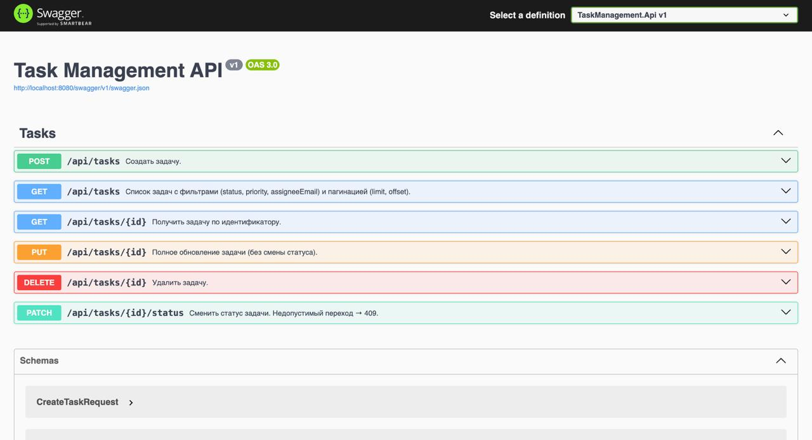
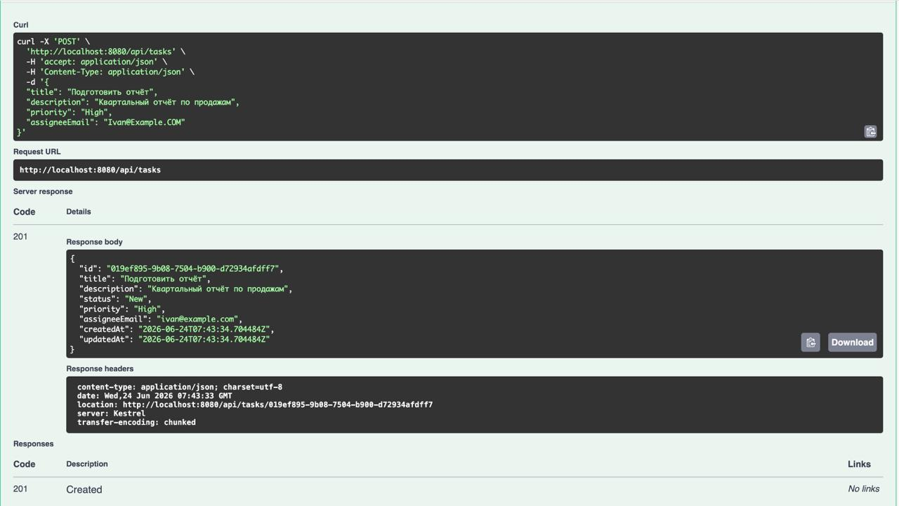
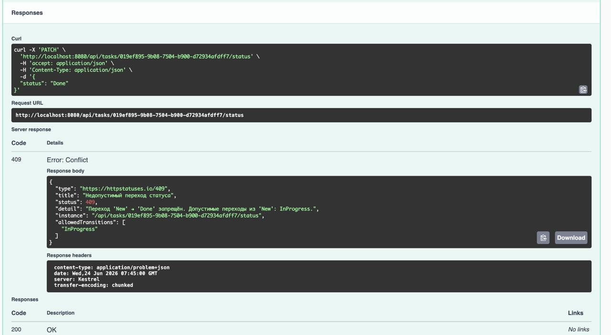
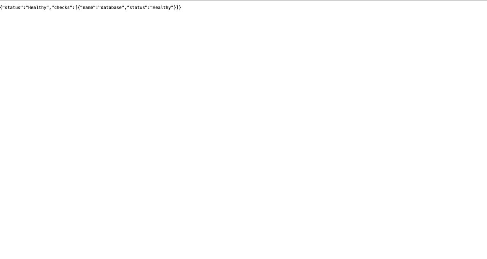

# Task Management API

Внутренний REST-сервис управления задачами: команды ведут свои таски (CRUD, статусы,
приоритеты, исполнители). Акцент на аккуратной слоёной архитектуре и обоснованных
технических решениях.

## Возможности

- CRUD задач: Id, название, описание, статус, приоритет, даты создания/обновления, email исполнителя.
- Статусы: `New`, `InProgress`, `Review`, `Done` — переходы ограничены конечным автоматом.
- Приоритеты: `Low`, `Medium`, `High`, `Critical`.
- Фильтрация (статус, приоритет, исполнитель) и пагинация (`limit`/`offset`).
- Валидация входных данных с понятными сообщениями (FluentValidation).
- Ошибки в формате ProblemDetails (RFC 7807).
- Уведомление исполнителю при назначении (мок — пишет в лог, без реальных писем).
- Health check с проверкой доступности БД.
- Swagger UI.

## Стек

- **.NET 8** (LTS), ASP.NET Core Web API (контроллеры).
- **EF Core 8** + Npgsql, **PostgreSQL 16**.
- **FluentValidation**, **Swagger** (Swashbuckle).
- Тесты: **xUnit** + **Testcontainers** + `WebApplicationFactory`.

## Архитектура

Прагматичный layered, 4 проекта. Зависимости направлены внутрь: `Api → Application ← Infrastructure`.

```
src/
  TaskManagement.Api             контроллеры, DI, middleware ошибок, Swagger, health
  TaskManagement.Application     entities, enums, DTO, сервисы, интерфейсы, валидаторы, маппинг
  TaskManagement.Infrastructure  AppDbContext, EF-конфигурации, миграции, репозиторий, email-мок
tests/
  TaskManagement.Tests           unit + интеграционные тесты
```

Application не зависит от EF Core и ASP.NET Core. Подробнее — в [AI_DECISIONS.md](AI_DECISIONS.md).

## Запуск (Docker)

Нужен установленный и запущенный Docker.

```bash
docker compose up --build
# либо standalone-бинарь: docker-compose up --build
```

Поднимается PostgreSQL и API; миграции применяются автоматически при старте. После запуска:

- Swagger UI: <http://localhost:8080/swagger>
- Health: <http://localhost:8080/health>

PostgreSQL наружу не пробрасывается (доступен только внутри сети compose). Учётные данные БД
заданы дефолтами `postgres/postgres` прямо в [docker-compose.yml](docker-compose.yml) — это демо.

### Быстрая проверка

```bash
curl -X POST http://localhost:8080/api/tasks \
  -H "Content-Type: application/json" \
  -d '{"title":"Первая задача","priority":"High","assigneeEmail":"user@example.com"}'

curl "http://localhost:8080/api/tasks?priority=High&limit=10"
```

## Эндпоинты

| Метод | Путь | Описание |
|---|---|---|
| `POST` | `/api/tasks` | Создать задачу → `201` + `Location` |
| `GET` | `/api/tasks` | Список: фильтры `status`, `priority`, `assigneeEmail`; пагинация `limit` (1..100, по умолчанию 20), `offset` |
| `GET` | `/api/tasks/{id}` | Получить задачу → `200` / `404` |
| `PUT` | `/api/tasks/{id}` | Полное обновление (без смены статуса) → `200` / `400` / `404` |
| `PATCH` | `/api/tasks/{id}/status` | Сменить статус → `200` / `404` / `409` (запрещённый переход) |
| `DELETE` | `/api/tasks/{id}` | Удалить → `204` / `404` |
| `GET` | `/health` | Liveness + проверка БД |

Допустимые переходы статусов: `New → InProgress`, `InProgress → Review|New`,
`Review → Done|InProgress`, `Done` — терминальный. Запрещённый переход возвращает `409`
с перечнем допустимых переходов.

## Скриншоты

Swagger UI и примеры запросов — в [docs/](docs/).

| | |
|---|---|
| Обзор эндпоинтов |  |
| Создание задачи (`POST`) |  |
| Запрещённый переход статуса → `409` |  |
| Health check |  |

## Тесты

Тесты разделены на unit (без внешних зависимостей) и интеграционные
(поднимают реальный PostgreSQL через Testcontainers и гоняют HTTP-конвейер
через `WebApplicationFactory`).

Требуется .NET 8 SDK; для интеграционных тестов — запущенный Docker.

```bash
dotnet test                                              # все тесты
dotnet test --filter "FullyQualifiedName~Unit"           # только unit (без Docker)
dotnet test --filter "FullyQualifiedName~Integration"    # только интеграционные (нужен Docker)
```

## Документация

- [CLAUDE.md](CLAUDE.md) — правила проекта и конвенции генерации кода.
- [AI_DECISIONS.md](AI_DECISIONS.md) — журнал принятых технических решений с обоснованиями.
- [PLAN.md](PLAN.md) — план реализации по этапам.
- [PROMPTS.md](PROMPTS.md) — история промптов/диалога по ходу разработки.
- [TOOLS.md](TOOLS.md) — инструменты, использованные при разработке.
